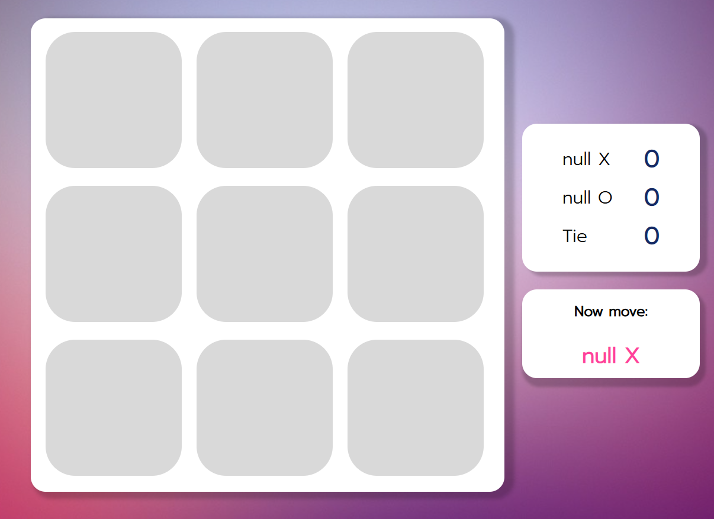
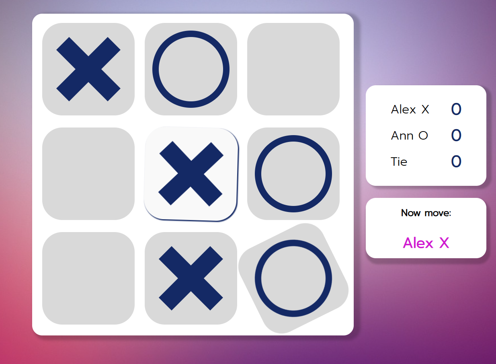
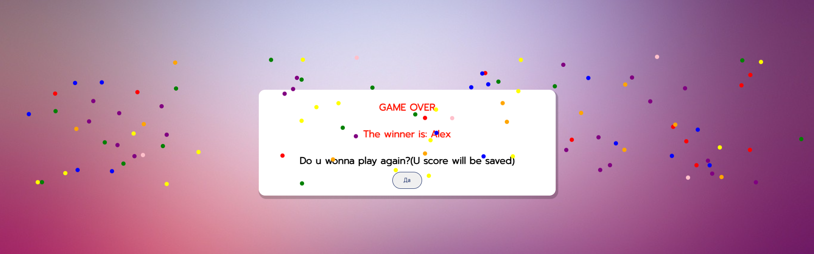
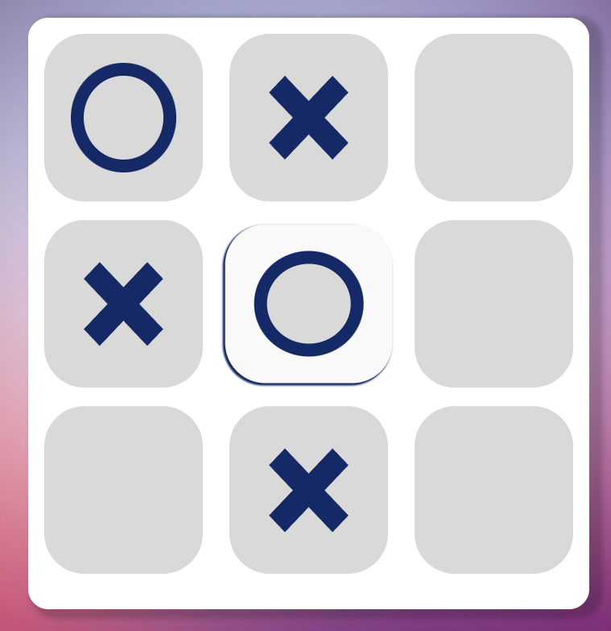
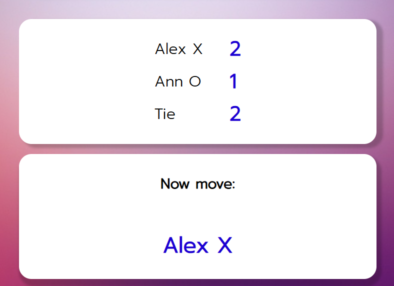

# Tic-Tac-Toe (Крестики-нолики)

Интерактивная игра "Крестики-нолики" для двух игроков с современным дизайном, адаптивной версткой и сохранением счета между партиями.

## 🚀 Как запустить проект

1. **Склонируйте репозиторий или скачайте архив с файлами.**
2. Откройте файл `index.html` в любом современном браузере (Chrome, Firefox, Edge и др.).
3. Игра готова к использованию — установка не требуется!

## 🕹 Как работает игра

- Два игрока (по умолчанию: Alex (X) и Ann (O)) по очереди делают ходы на поле 3x3.
- После каждого хода отображается, чей сейчас ход.
- После завершения партии (победа или ничья) появляется всплывающее окно с результатом и предложением сыграть еще раз.
- Счетчик побед и ничьих сохраняется между партиями (пока не обновите страницу).
- Игра полностью адаптивна — удобно играть как на компьютере, так и на мобильных устройствах.

## 🖼️ Скриншоты

### Главное игровое поле

### Модальное окно окончания партии

### Адаптивная верстка (мобильная версия)

> **Примечание:** Скриншоты взяты из реального интерфейса игры.

## ⚙️ Особенности

- **Адаптивный дизайн** — удобно на любом устройстве.
- **Сохранение счета** между партиями (в рамках одной сессии).
- **Красочная анимация победы** (конфетти).
- **Простой запуск** — не требует установки зависимостей.
- **Интуитивный интерфейс** и понятные подсказки.

## 📁 Структура проекта

- `index.html` — основная страница игры
- `scripts/` — скрипты для логики игры и анимации
- `styles/` — стили оформления
- `img/` — изображения и иконки

---

**Приятной игры!**
